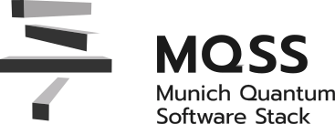
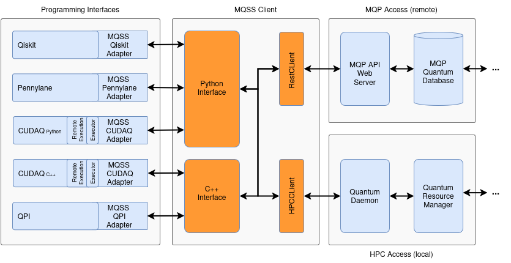

<!----------------------------------------------------------------------------
Copyright 2024 Munich Quantum Software Stack Project

Licensed under the Apache License, Version 2.0 with LLVM Exceptions (the
"License"); you may not use this file except in compliance with the License.
You may obtain a copy of the License at

https://github.com/Munich-Quantum-Software-Stack/MQSS-CUDAQ-Adapter/blob/develop/LICENSE

Unless required by applicable law or agreed to in writing, software
distributed under the License is distributed on an "AS IS" BASIS, WITHOUT
WARRANTIES OR CONDITIONS OF ANY KIND, either express or implied. See the
License for the specific language governing permissions and limitations under
the License.

SPDX-License-Identifier: Apache-2.0 WITH LLVM-exception
---------------------------------------------------------------------------->

  <picture>
    <source media="(prefers-color-scheme: dark)" srcset="./docs/_static/mqss_logo_dark.svg" width="20%">
    
  </picture>

# MQSS CUDA-Q Adapter

<!-- [DOXYGEN MAIN] -->

The MQSS CUDA-Q Adapter serves as a bridge between the CUDA-Q programming interface and the Munich
Quantum Software Stack (MQSS). It enables seamless integration by providing two primary access
points: the Munich Quantum Portal (MQP), a cloud-based interface for remote quantum job submission,
and a high-performance computing (HPC) access point for users working on local or institutional HPC
resources. This module allows developers to write quantum-classical hybrid programs using CUDA-Q
while leveraging MQSS infrastructure for optimization, execution and quantum devices management.

<!-- [DOXYGEN MAIN] -->

  

## FAQ

<!-- [DOXYGEN FAQ] -->

### What is MQSS?

**MQSS** stands for _Munich Quantum Software Stack_, which is a project of the _Munich Quantum
Valley (MQV)_ initiative and is jointly developed by the _Leibniz Supercomputing Centre (LRZ)_ and
the Chairs for _Design Automation (CDA)_, and for _Computer Architecture and Parallel Systems
(CAPS)_ at TUM. It provides a comprehensive compilation and runtime infrastructure for on-premise
and remote quantum devices, support for modern compilation and optimization techniques, and enables
both current and future high-level abstractions for quantum programming. This stack is designed to
be capable of deployment in a variety of scenarios via flexible configuration options, including
stand-alone scenarios for individual systems, cloud access to a variety of devices as well as tight
integration into HPC environments supporting quantum acceleration. Within the MQV, a concrete
instance of the MQSS is deployed at the LRZ for the MQV, serving as a single access point to all of
its quantum devices via multiple compatible access paths, including a web portal, command line
access via web credentials as well as the option for hybrid access with tight integration with LRZ's
HPC systems. It facilitates the connection between end-users and quantum computing platforms by its
integration within HPC infrastructures, such as those found at the LRZ.

### What is the MQSS CUDA-Q Adapter?

    

The MQSS CUDA-Q Adapter is a middleware module designed to bridge the CUDA-Q programming interface
with the Munich Quantum Software Stack (MQSS). Its purpose is to enable users who develop quantum
applications using the CUDA-Q API—whether in C++ or Python—to transparently execute their quantum
kernels on MQSS-supported backends.

As shown in the diagram, the user's code interfaces with the CUDA-Q API, which manages either local
simulation or remote execution. The MQSS CUDA-Q Adapter fits into this remote execution path through
two main access points:

- **HPC Execution:** The quantum job is routed from RemoteRESTQPU to the HPC node, then through an
  Executor and a RabbitMQ Client, finally reaching the MQSS HPC Adapter. This path is tailored for
  users running from high-performance computing environments and ensures compatibility with MQSS job
  management infrastructure.

- **Cloud Access Path via Munich Quantum Portal (MQP)**: Alternatively, users may access MQSS
  services through the Munich Quantum Portal (MQP). Jobs are sent via the same core logic,
  eventually reaching the MQSS MQP Adapter, which handles cloud-based dispatching of quantum
  workloads to target hardware or simulators supported by MQSS.

Together, these adapters abstract away the complexity of targeting specific hardware or services,
allowing CUDA-Q users to compile, submit, and retrieve quantum results through the MQSS. The MQSS
CUDA-Q Adapter ensures smooth interoperability and helps integrate CUDA-Q's compiler infrastructure
with MQSS's distributed quantum computing ecosystem.

### Where is the code?

The code is publicly available and hosted on GitHub:
https://github.com/Munich-Quantum-Software-Stack/MQSS-CUDAQ-Adapter

### Under which license is the **MQSS CUDA-Q Adapter** released?

The MQSS CUDA-Q Adapter is released under the Apache License v2.0 with LLVM Exceptions. See
[LICENSE](https://github.com/Munich-Quantum-Software-Stack/MQSS-CUDAQ-Adapter/blob/develop/LICENSE)
for more information. Any contribution to the project is assumed to be under the same license.

<!-- [DOXYGEN FAQ] -->
